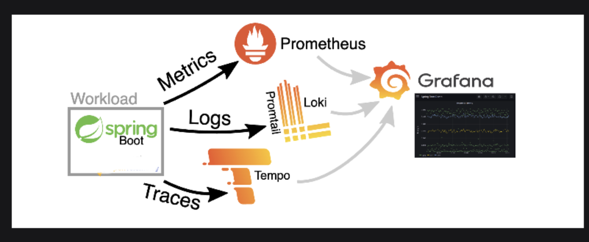
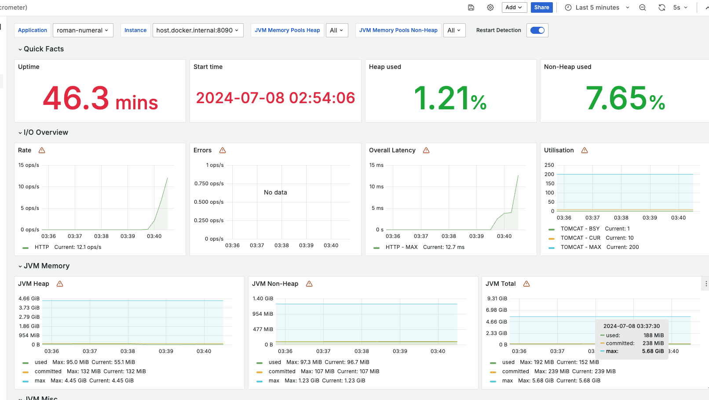

# Roman Numeral

## Overview

This project provides an API to convert numbers to Roman numerals, including support for Vinculum notation for numbers greater than 3999, and handles all numbers up to 2,200,000,000. The project is built using Java and runs in a Docker environment.

## Arichitecture


## Tech Stack

* Java 17
* spring-boot 3
* gradle 
* spock - Unit and Integration Testing
* k6 - Perf Testing
* Swagger
* Grafana
* Prometheus
* Tempo
* Loki
* Docker
* Docker-Compose
## How to Build and Run the Project

### Prerequisites

- Docker
- Docker Compose
- Java Development Kit (JDK) 17
- Gradle

### Build the Project

1. Clone the repository:
    ```bash
    git clone git@github.com:prasadchandrasekaran/roman-numeral.git
    cd roman-numeral
    ```

2. Build the project using Maven:
    ```bash
    ./gradlew clean build
    ```

### Run the Project

1. Start the Docker containers:
    ```bash
    docker-compose up --build
    ```

2. The application will be available at `http://localhost:8090`.

### API Endpoints

- `GET romannumeral?number=`: Converts a number to a Roman numeral.

### Swagger UI

You can view the API documentation and test the endpoints using Swagger UI. To access the Swagger UI, open your web browser and navigate to:

[http://localhost:8090/swagger-ui/index.html](http://localhost:8090/swagger-ui/index.html)

## Engineering and Testing Methodology

### Methodology

- **Development**: The application was developed following TDD (Test-Driven Development) principles.
- **Testing**: The project includes unit tests for all core functionality. Performance tests are included to demonstrate the scalability and efficiency of the solution.
- **Documentation**: Inline comments are included in the source code to explain the logic. This README provides an overview and instructions for building, running, and testing the project.

### Testing

1. Run unit tests and integration test:
    ```bash
    ./gradlew test
    ```

**Performance Testing**:
- **k6 Performance Tests**: Performance tests are included in the `k6` folder and can be run as part of Docker Compose.


### Error Handling

- The application includes comprehensive error handling for invalid inputs and out-of-range values.
- HTTP 400 responses are returned for invalid inputs, with descriptive error messages.

## Packaging Layout

- `src/main/java`: Contains the main application code.
- `src/main/resources`: Contains the application configuration files.
- `src/test/groovy`: Contains unit and integration test.
- `docker`: Contains Docker-related files, including Dockerfile and Docker Compose configuration.
- `logs`: Directory for application logs.
- `k6`: Directory for application logs.


## Extensions

### Extension 1: Numbers 1-3999

The application correctly converts numbers from 1 to 3999 to Roman numerals.

### Extension 2: Vinculum Notation

The application supports Vinculum notation for numbers greater than 3999, handling numbers up to 2,200,000,000.

### Extension 3: Dev-Ops Capabilities

- **Metrics**: Micrometer integration provides application metrics.
- **Monitoring**: Prometheus and Grafana are used for monitoring. Grafana dashboards visualize the metrics.
- **Logging**: Loki and Grafana Loki are used for centralized logging.

## Dev-Ops Setup

### Docker Compose

The Docker Compose setup includes the application, Loki, Prometheus, Grafana and k6. Use the following command to start the entire stack:
```bash
docker-compose up --build
```
### Metrics Details : 

http://localhost:3000/dashboards

The metrics include latency details, throughput, and a latency heat map. These metrics help in monitoring the performance and identifying bottlenecks.

#### Latency


#### JVM 




### Log Details : 

Loki integrates seamlessly with Grafana, allowing you to visualize logs alongside your metrics and traces, providing a comprehensive observability solution.


### Trace Details :

http://localhost:3000/explore?schemaVersion=1&panes=%7B%22j16%22:%7B%22datasource%22:%22tempo%22,%22queries%22:%5B%7B%22refId%22:%22A%22,%22datasource%22:%7B%22type%22:%22tempo%22,%22uid%22:%22tempo%22%7D,%22queryType%22:%22traceqlSearch%22,%22limit%22:20,%22tableType%22:%22traces%22,%22filters%22:%5B%7B%22id%22:%225d755596%22,%22operator%22:%22%3D%22,%22scope%22:%22span%22%7D%5D%7D%5D,%22range%22:%7B%22from%22:%22now-5m%22,%22to%22:%22now%22%7D%7D,%22qfq%22:%7B%22datasource%22:%22tempo%22,%22queries%22:%5B%7B%22query%22:%22668bbb771035feac41632026ef8171c2%22,%22queryType%22:%22traceql%22,%22refId%22:%22A%22,%22limit%22:20,%22tableType%22:%22traces%22%7D%5D,%22range%22:%7B%22from%22:%221720433243202%22,%22to%22:%221720433543202%22%7D%7D%7D&orgId=1


#### Trace Example

The Tempo dashboard provides essential tracing information, including traces and spans, which are vital for understanding your application's behavior. Tracing identifies performance bottlenecks, monitors request flows, and diagnoses issues within a microservices architecture.


In this example, the dashboard displays traces for various API calls, detailing the duration and specifics of each span. This visual aid helps you comprehend the request flow through the system and pinpoint any performance issues.


One of the powerful features of Tempo is its integration with Loki. By clicking on "Logs" for a specific span in Tempo, you are taken directly to the corresponding logs in Loki. This seamless transition between tracing and logging significantly enhances your debugging capabilities, allowing you to correlate traces with logs effortlessly.
